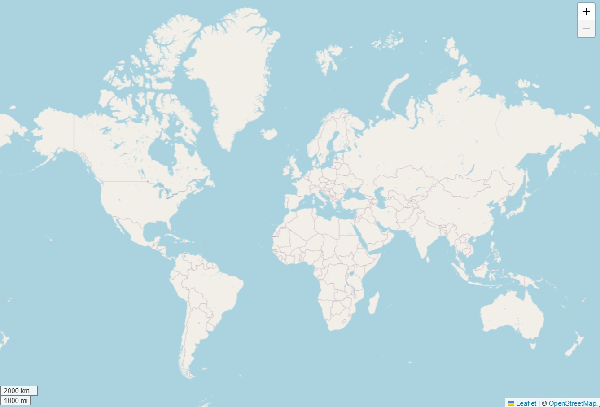
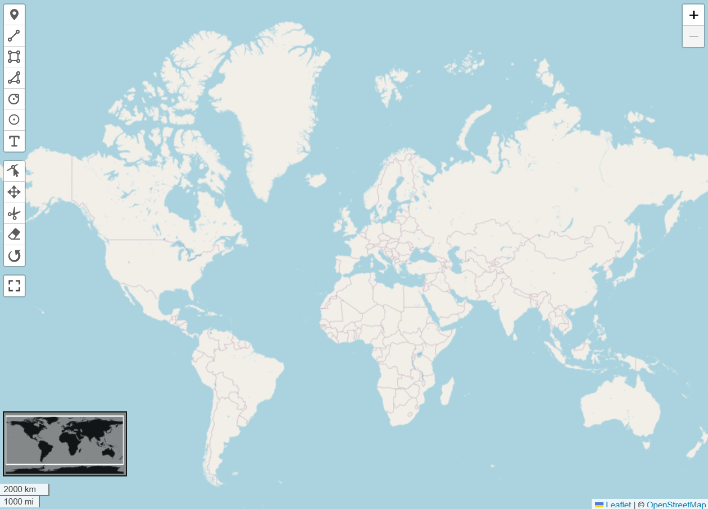

# 🍃Leaflet Map Templates
This repository template for Leaflet web maps will help you start a new leaflet map project quickly.

## ✨ Getting Started
1. On the main page of this repository, click <b>Use this template</b> (above the file list).
2. Select <b>Create a new repository</b>.
3. Use the Owner dropdown menu to select the account you want to own the repository.
4. Enter a name for your repository.
5. To include the directory structure and files from all branches in the template, and not just the default branch, select <b>Include all branches</b>.
6. Give this repo a ⭐ (This step is entirely optional of course, but if you do - you are a very nice person :D)

## 📌 Options
### Main Branch (Default)
- Basic Leaflet map with zoom buttons and a scale bar.
- Centered with a global map view.
- Additional settings are added to prevent scrolling off the map, and map bounds are set to give it a bounce-back effect.

### 1-minimap
- Basic Leaflet map
- Includes <a href="https://github.com/maneoverland/leaflet.WorldMiniMap">leaflet.WorldMiniMap</a> Plugin

### Version 1
This branch includes a few useful plugins. The Leaflet-Geoman drawing toolbar is a great addition  as it provides the functionality to add markers, lines and polygons on the map.
- <a href="https://www.geoman.io/docs/getting-started/free-version">Leaflet-Geoman Drawing Toolbar</a>
- <a href="https://github.com/Leaflet/Leaflet.fullscreen">Full-screen button</a>
- Includes <a href="https://github.com/maneoverland/leaflet.WorldMiniMap">leaflet.WorldMiniMap</a> Plugin

## 🏆 Goals
- The purpose of this repository is so that the initial setup for a Leaflet map is quick and easy. (My goal was to be able to quickly set up a Leaflet web map repo with the setup I had used in previous projects)
- Explore various Leaflet map options and variations in different branches.
- This is great for any beginners that want to explore the use of JavaScript Leaflet library.

## 🔧 Dependencies
- <a href="https://jquery.com/">JQuery 3.7.1</a> - A JavaScript library used to simplify the client-side scripting of HTML
- <a href="https://unpkg.com/leaflet@1.9.4/dist/leaflet.js">Leaflet Library</a> - Open-source JavaScript library for interactive maps
 
<b>1-minimap</b>
- <a href="https://github.com/maneoverland/leaflet.WorldMiniMap">leaflet.WorldMiniMap</a> - Leaflet plugin that adds a small world-map-image, in which the actual view of the Leaflet Map is shown